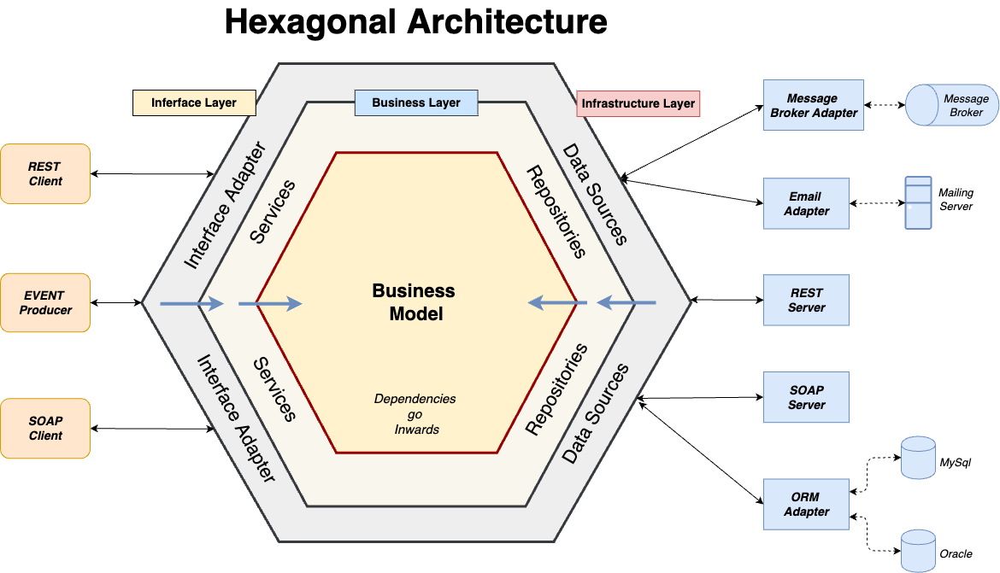

# Backend-проект для умного бюджета

Этот проект построен на принципах гексагональной архитектуры с использованием Spring и Java, создавая высокофункциональное и гибкое backend-приложение для управления финансами.

## Описание проекта

Приложение организовано по слоям, что позволяет достичь отличной расширяемости, тестируемости и упрощения разработки, следуя концепциям гексагональной архитектуры.



## Технологический стек

- **Java**
- **Spring Framework**
- **Spring Boot** (JPA, Security, Web)
- **Lombok**
- **PostgreSQL**

## Запуск на локальной машине

Для локального запуска приложения потребуется настроить следующие переменные окружения:

- `DATABASE_HOST` — адрес хоста базы данных
- `DATABASE_NAME` — имя базы данных
- `DATABASE_USERNAME` — имя пользователя базы данных
- `DATABASE_PASSWORD` — пароль для базы данных
- `JWT_SECRET` — секретный ключ JWT
- `JWT_EXPIRATION_MS` — время жизни токена JWT (в миллисекундах)
- `JWT_REFRESH_EXPIRATION_MS` — время жизни refresh-токена JWT (в миллисекундах)
- `LOG_PATH` — путь к файлу логов

### Пример запуска

Для запуска приложения используйте команду:

```bash
mvn spring-boot:run